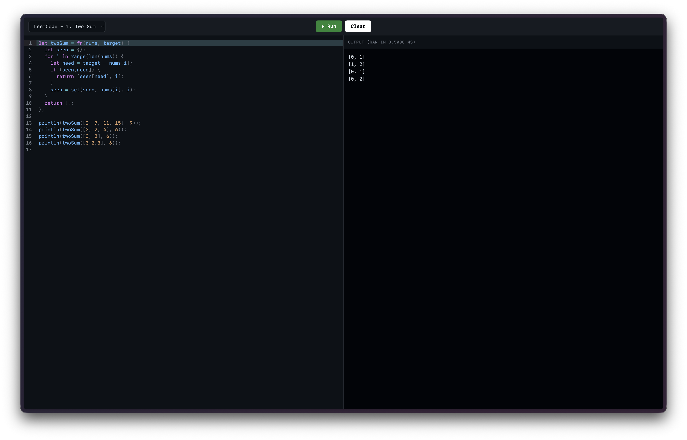

<a id="readme-top"></a>

<h1>
  <a href="https://github.com/tahminator/abclang">
    abclang
  </a>
</h1>

[](https://github.com/tahminator/abclang/tags)
[](https://www.rust-lang.org/)
[](https://webassembly.org/)

<div align="center">
  
</div>

<p align="center">
  <a href="https://abclang.tahmid.io">View the online playground at abclang.tahmid.io</a>
</p>

abclang is a small, dynamically-typed programming language with a hand-written tree-walking interpreter in [Rust](https://www.rust-lang.org/), compiled to [WebAssembly](https://webassembly.org/) so it can run entirely in your browser. It ships with both a native REPL and a web-based playground.

The language design is heavily inspired by the [Monkey language](https://interpreterbook.com/) from Thorsten Ball's _Writing an Interpreter in Go_ (`let` bindings, first-class functions, closures, and a [Pratt parser](https://en.wikipedia.org/wiki/Operator-precedence_parser)), extended with floats, `for ... in` loops, mutable arrays/hashmaps, and a handful of extra builtins.

This is an ongoing project, and I will continue to extend the language with as many things as I can think of.

## Features

_Last updated: 07/25/2026_

abclang supports

- [Two number types: 64-bit integers and floats, with automatic int to float promotion when mixed](./interpreter/src/eval/client.rs#L406)
- [`let` bindings and reassignment](./interpreter/src/eval/client.rs#L57)
- [First-class functions (`fn`), closures, and recursion](./interpreter/src/eval/client.rs#L100)
- [`if` / `else` as an **expression** that evaluates to a value](./interpreter/src/eval/client.rs#L304)
- [`for ... in` loops over arrays, ranges, and hashmaps (`for key, value in map`)](./interpreter/src/eval/client.rs#L326)
- [Strings with `+` concatenation](./interpreter/src/eval/client.rs#L444)
- [Arrays and hashmaps (both mutable, both allowed to be heterogeneous)](./interpreter/src/eval/client.rs#L178)
- [Index access & assignment, including nested (`people[1]["name"]`)](./interpreter/src/eval/client.rs#L196)
- [`//` line comments](./interpreter/src/lexer/client.rs#L196)
- [A standard library of builtins: `len`, `max`, `min`, `first`, `last`, `rest`, `push`, `set`, `range`, `print`, `println`](./interpreter/src/eval/builtins.rs#L8)

There is no server-side runtime. The interpreter compiles to WebAssembly and executes fully client-side in the web playground.

### Small example

```rust
// closures capture their surrounding environment
let newAdder = fn(x) {
  fn(y) { x + y };
};

let addTwo = newAdder(2);
println(addTwo(2)); // => 4

// if/else is an expression
let classify = fn(n) {
  if (n > 0) { "positive" } else { "non-positive" };
};

// arrays, hashmaps, and for loops
let ages = {"alice": 30, "bob": 25};
for name, age in ages {
  println(name, age);
}
```

> [!NOTE]
> The web playground ships with a set of runnable examples (arithmetic, closures, recursion, iterators, and even a LeetCode "Two Sum" solution). They live in [`app/src/lib/examples.ts`](./app/src/lib/examples.ts).

## Structure

_Last updated: 07/25/2026_

This repository is a [Cargo workspace](https://doc.rust-lang.org/book/ch14-03-cargo-workspaces.html) plus a frontend, split into a few distinct pieces:

- The interpreter itself, written in [Rust](https://www.rust-lang.org/). This is the heart of the project: a hand-written [lexer](./interpreter/src/lexer/), a [Pratt parser](./interpreter/src/parser/) that produces an [AST](./interpreter/src/ast/), and a tree-walking [evaluator](./interpreter/src/eval/) with its own object system, environments, and [builtins](./interpreter/src/eval/builtins.rs).
  - [Goto `interpreter/`](./interpreter/)
- A native REPL built on [rustyline](https://github.com/kkawakam/rustyline) that consumes the `interpreter` crate directly. It supports a `dprint ` prefix to dump the parsed AST for any line.
  - [Goto `repl/`](./repl/)
  - [View the REPL loop](./repl/src/client.rs)
- A thin [wasm-bindgen](https://rustwasm.github.io/wasm-bindgen/) wrapper that exposes the interpreter to JavaScript. It exports an `Interpreter` class (with `evaluate` and `reset`) as well as a `tokenize` function used to drive editor syntax highlighting.
  - [Goto `wasm/`](./wasm/)
  - [View the wasm entrypoint](./wasm/src/lib.rs)
- The web playground, written in [TypeScript](https://www.typescriptlang.org/) and [React 19](https://react.dev/) + [Vite](https://vite.dev/), with a [CodeMirror 6](https://codemirror.net/) editor. It loads the compiled `.wasm` module and runs abclang entirely in the browser.
  - [Goto `app/`](./app/)
- My container image, defined as a multi-stage [Docker](https://www.docker.com/) build that compiles the wasm, builds the React app, and serves the static bundle with [nginx](https://nginx.org/).
  - [Goto `infra/`](./infra/Dockerfile)
- My CI/CD pipeline, which runs on [GitHub Actions](https://github.com/features/actions) with reusable composite actions and [Bun](https://bun.com/) + [TypeScript](https://www.typescriptlang.org/) scripts. On `main` it tests, builds & pushes the [`tahminator/abclang`](https://hub.docker.com/r/tahminator/abclang) image to [Docker Hub](https://hub.docker.com/), and tags the commit. Tags then trigger a GitOps deploy that opens a PR against my Kubernetes manifest repo.
  - [Goto `.github/`](./.github/)
  - [Goto `.github/scripts/`](./.github/scripts/)

### Directory tree

```
abclang
├── interpreter                 # the language, as a reusable Rust library crate
│   └── src
│       ├── lexer               # source text -> tokens (+ comment spans for highlighting)
│       ├── parser              # tokens -> AST, via a Pratt (operator-precedence) parser
│       ├── ast                 # statement & expression node definitions
│       └── eval                # tree-walking evaluator
│           ├── builtins.rs     # len, max, min, first, last, rest, push, set, range, print, println
│           └── object          # runtime object system + lexical environments
├── repl                        # native rustyline REPL that links against `interpreter`
├── wasm                        # wasm-bindgen bindings: Interpreter class + tokenize()
│   └── src/tokenizer           # maps token types -> highlight categories
├── app                         # React + Vite + CodeMirror playground
│   └── src
│       ├── ui/editor           # Editor, Toolbar, CodePanel, OutputPanel
│       ├── hooks/editor.ts     # editor state (code, examples, run, clear)
│       └── lib
│           ├── abclang         # generated wasm bindings (output of `just build-wasm`)
│           ├── examples.ts     # the runnable example snippets
│           └── editor          # CodeMirror syntax highlighting via wasm `tokenize`
├── infra
│   └── Dockerfile              # wasm builder -> frontend builder -> nginx runtime
├── .github                     # CI/CD workflows, composite actions, and Bun scripts
└── Justfile                    # dev/build/test task runner commands
```

## How it works

A program flows through the same three stages whether it runs in the REPL or the browser:

1. **Lexing**: [`Lexer`](./interpreter/src/lexer/) walks the source and produces a stream of [`Token`](./interpreter/src/lexer/token.rs)s. Keywords like `fn`, `let`, `if`, `for`, and `in` are recognized via a compile-time [`phf`](https://github.com/rust-phf/rust-phf) map. The lexer also records comment spans separately so the editor can highlight them.
2. **Parsing**: [`Parser`](./interpreter/src/parser/) turns tokens into an [AST](./interpreter/src/ast/) using a Pratt parser. Operator [precedence](./interpreter/src/parser/precedence.rs) runs from `Lowest` up through equality, comparison, sum, product, prefix, call, and index.
3. **Evaluation**: [`evaluate`](./interpreter/src/eval/) walks the AST against an [`Environment`](./interpreter/src/eval/object/environment.rs). Every value is an [`Object`](./interpreter/src/eval/object/client.rs) (`Integer`, `Float`, `Boolean`, `String`, `Array`, `Hash`, `Function`, and so on). Closures capture their defining environment, and `print`/`println` write into an output buffer that the host (REPL or web app) drains after the run.

> [!NOTE]
> The interpreter crate has no I/O of its own beyond that captured output buffer, which is what makes it safe and easy to drop into a WebAssembly sandbox.

## Setup

### Requirements

- [Rust](https://www.rust-lang.org/tools/install) (2024 edition) with `cargo`
- [`just`](https://github.com/casey/just): the task runner used for all commands below
- [`wasm-pack`](https://rustwasm.github.io/wasm-pack/): to compile the interpreter to WebAssembly
- [`pnpm`](https://pnpm.io/): to run the frontend

### Commands

All common tasks are wired up in the [`Justfile`](./Justfile):

```sh
# start the native REPL
just dev

# compile the interpreter to wasm and write bindings into app/src/lib/abclang
just build-wasm

# build the wasm, then start the Vite dev server for the playground
just wasm-dev

# run the Rust test suite and the frontend lint checks
just test
```

> [!WARNING]
> The frontend imports the generated wasm bindings from [`app/src/lib/abclang`](./app/src/lib/abclang). If you're running the playground for the first time (or after changing any Rust code), run `just build-wasm` first. `just wasm-dev` does this for you.

### REPL tips

The REPL prompt is `<< `. Prefix any line with `dprint ` to print the parsed AST for that line instead of evaluating it, which is handy when debugging parser behavior.

```
<< let x = 5 * (2 + 3);
<< x
25
```

For example, `dprint 1 + 2 * 3` shows how precedence nests the multiplication under the addition in the parsed AST:

```
Program {
    statements: [
        Expression(
            ExpressionStatement {
                token: Token { literal: "1", typ: Int },
                expr: Infix(
                    InfixExpression {
                        token: Token { literal: "+", typ: Plus },
                        left: IntegerLiteral(
                            IntegerLiteralExpression {
                                token: Token { literal: "1", typ: Int },
                                value: 1,
                            },
                        ),
                        op: "+",
                        right: Infix(
                            InfixExpression {
                                token: Token { literal: "*", typ: Asterisk },
                                left: IntegerLiteral(
                                    IntegerLiteralExpression {
                                        token: Token { literal: "2", typ: Int },
                                        value: 2,
                                    },
                                ),
                                op: "*",
                                right: IntegerLiteral(
                                    IntegerLiteralExpression {
                                        token: Token { literal: "3", typ: Int },
                                        value: 3,
                                    },
                                ),
                            },
                        ),
                    },
                ),
            },
        ),
    ],
}
```

## Deployment

The [`Dockerfile`](./infra/Dockerfile) is a three-stage build:

1. A `rust` stage installs `wasm-pack` and compiles the `wasm` crate.
2. A `node` stage installs frontend dependencies, pulls in the generated wasm bindings, and runs `pnpm build`.
3. An `nginx:alpine` stage serves the static `dist/` bundle.

On every push to `main`, [CI](./.github/workflows/ci.yaml) runs the test suite, builds & pushes the `tahminator/abclang` image to Docker Hub, and creates a new git tag. Pushing a tag triggers [CD](./.github/workflows/cd.yaml), which promotes the image and opens a GitOps PR against my Kubernetes manifest repo to roll the new version out to production.
